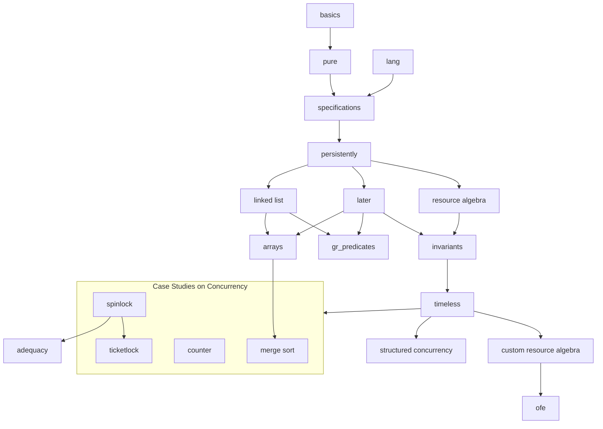

# Iris Tutorial in Lean

This is a port of [Iris Tutorial](https://github.com/logsem/iris-tutorial) to Iris-Lean. The Iris Tutorial is an introduction to the [Iris separation logic framework](https://iris-project.org/) and how to work with its [Rocq formalization](https://gitlab.mpi-sws.org/iris/iris/).

The original prose is deliberately left intact, at least until the full tutorial is ported. This port is unrelated to the [logsem port](https://github.com/logsem/iris-tutorial-lean), where both code and prose were translated by an LLM.

The exposition is intended for a broad range of readers from advanced undergraduates to PhD students and researchers. We assume that readers are already motivated to learn Iris and thus present the material in a bottom-up fashion, rather than starting out with cool motivating examples. The tutorial material is intended to be self-contained. No specific background in logic or programming languages is assumed but some familiarity with basic programming languages theory and discrete mathematics will be beneficial, see e.g. [TAPL](https://www.cis.upenn.edu/~bcpierce/tapl/). Additionally, basic knowledge of the Rocq prover is assumed. Advanced Rocq tactics have been purposefully kept to a minimum, and some proofs are longer than necessary to facilitate learning. We demonstrate more advanced tactics in chapter [ticket_lock_advanced](/theories/ticket_lock_advanced.v).

The original tutorial comes in two versions:

- The folder `exercises`: a skeleton development with exercises left admitted.
- The folder `theories`: the full development with solutions.

The ported tutorial omits solutions to exercises.

The tutorial consists of several chapters, each corresponding to a Lean file. The graph in [Chapter Dependencies](README.md#chapter-dependencies) illustrates possible ways to go through the tutorial. However, the recommended order is specified in the [Recommended Learning Path](README.md#recommended-learning-path).

## Setup

Unlike in Rocq, the setup is easy:

1. Install Lean
2. Run `lake build` to download dependencies and build the project

## Chapter Overview

Here are ported chapters:

- [basics](/IrisTutorial/Basics.lean) - Introduction to the separation
  logic and the Iris Proof Mode
- [pure](/IrisTutorial/Pure.lean) - Distinction between the Rocq context and the Iris context
- [lang](/IrisTutorial/Lang.lean) - Introduction to HeapLang
- [specifications](/IrisTutorial/Specifications.lean) - Weakest precondition,
  basic resources, Hoare triples, and basic concurrency
- [persistently](/IrisTutorial/Persistently.lean) - The persistently modality
- [linked_lists](/IrisTutorial/LinkedLists.lean) - Linked lists
- [later](/IrisTutorial/Later.lean) - The later modality and recursive functions
- [arrays](/IrisTutorial/Arrays.lean) - Arrays in HeapLang
- [gr_predicates](/IrisTutorial/GrPredicates.lean) - Guarded Recursive Predicates (TODO: not actually guarded fixpoints, only least)
- [resource_algebra](/IrisTutorial/ResourceAlgebra.lean) - Introduction to resource algebras
- [invariants](/IrisTutorial/Invariants.lean) - Invariants

And these chapters are yet to be ported:

- [timeless](/IrisTutorial/Timeless.lean) - Timeless propositions
- [structured_conc](/IrisTutorial/StructuredConc.lean) - Introducing the spawn and par constructs
- [counter](/IrisTutorial/Counter.lean) - The authoritative camera
- [spin_lock](/IrisTutorial/SpinLock.lean) - Specification of a spin lock
- [ticket_lock](/IrisTutorial/TicketLock.lean) - Specification of a ticket lock
- [ticket_lock_advanced](/theories/TicketLockAdvanced.v) - Advanced Rocq tactics
- [adequacy](/IrisTutorial/Adequacy.lean) - Adequacy
- [merge_sort](/IrisTutorial/MergeSort.lean) - Merge sort
- [custom_ra](/IrisTutorial/CustomRa.lean) - Defining resource algebras from scratch
- [ofe](/IrisTutorial/Ofe.lean) - Detailed introduction to OFEs

## Chapter Dependencies

## Recommended Learning Path

To get a good understanding of the fundamental concepts of Iris, it is recommended to study the following chapters in the given order.

1. [basics](/IrisTutorial/Basics.lean)
2. [pure](/IrisTutorial/Pure.lean)
3. [lang](/IrisTutorial/Lang.lean)
. [specifications](/IrisTutorial/Specifications.lean)
5. [persistently](/IrisTutorial/Persistently.lean)
6. [linked_lists](/IrisTutorial/LinkedLists.lean)
7. [later](/IrisTutorial/Later.lean)
8. [arrays](/IrisTutorial/Arrays.lean)
9. [resource_algebra](/IrisTutorial/ResourceAlgebra.lean)
10. [invariants](/IrisTutorial/Invariants.lean)
11. [timeless](/IrisTutorial/Timeless.lean)
12. [structured_conc](/IrisTutorial/StructuredConc.lean)
13. [counter](/IrisTutorial/Counter.lean)
14. [spin_lock](/IrisTutorial/SpinLock.lean)
15. [ticket_lock](/IrisTutorial/TicketLock.lean)
16. [adequacy](/IrisTutorial/Adequacy.lean)

## Exercises

To work on the exercises, simply edit the files in the IrisTutorial/ folder. Some proofs and definitions are admitted and marked as `(exercise)` --- your task is to fill in those definitions and complete the proofs all the way to 🎉.

After you are done with a file, run `lake build` (with your working directory being the repository root, where the `lakefile.toml` is located) to compile and check the exercises.

## Documentation

This [cheatsheet](/cheatsheet.md) contains a table of the most important tactics for each logical connective. A full description of the Iris Proof Mode tactics in Rocq can be found in the files [proof_mode.md](https://gitlab.mpi-sws.org/iris/iris/-/blob/master/docs/proof_mode.md) and [heap_lang.md](https://gitlab.mpi-sws.org/iris/iris/-/blob/master/docs/heap_lang.md).

Description of Iris-Lean tactics can be found in [tactics.md](https://github.com/leanprover-community/iris-lean/blob/master/Iris/tactics.md) in the Iris-Lean repository.

## Optional Reading

Currently, the [Iris Lecture Notes](https://iris-project.org/tutorial-material.html) cover all the material presented in this tutorial and more. The lecture notes are not required to work through the tutorial, but readers may want to refer to the lecture notes for additional/alternative explanations of introduced concepts.

In its current state, this tutorial does not go over the underlying model of Iris. For readers who wish to learn about the underlying model of Iris, we refer to the [Iris from the ground up](https://people.mpi-sws.org/~dreyer/papers/iris-ground-up/paper.pdf) paper. Advanced readers may read this paper prior to going through the tutorial. However, it is generally recommended to study it afterwards, given its technical nature.
